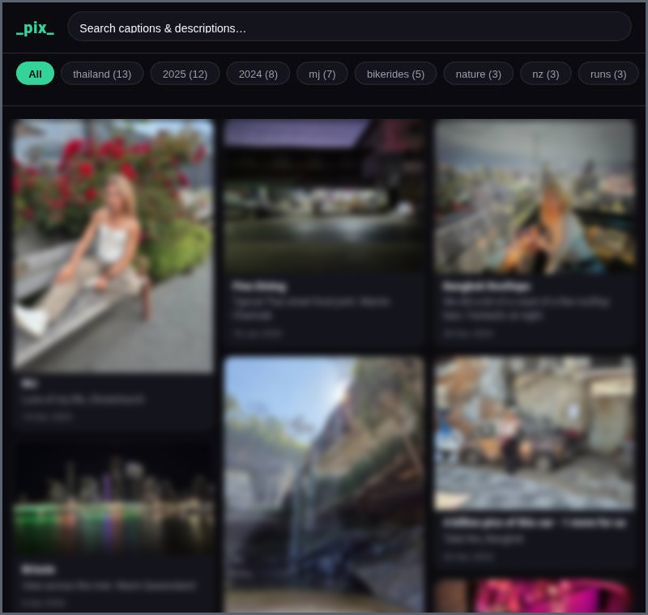
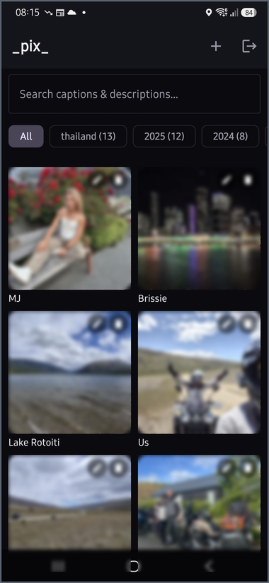

# _pix_

A minimal, self-hosted photo & video gallery. Scrollable, searchable,
filterable by tag. Full-size media only loads when you open it; the index
page shows generated thumbnails. Single admin login for uploading/editing —
everyone else just browses.





Browse a scrollable, searchable gallery filtered by tag, with full-size
photos and video only loading when you open them. Log in as admin to
upload (camera or gallery picker, photos or video), edit captions,
descriptions, tags and dates, rotate images, or delete — from the web UI
or the native Android app, which talks to the same API and works against
any pix server you point it at.

## Stack

- FastAPI (Python) backend, SQLite for metadata, Pillow/ffmpeg for thumbnails.
- Vanilla HTML/CSS/JS frontend — no build step.
- Single container; images and the DB live on a bind-mounted data directory.
- One admin password (env var), no user accounts — this is a single-tenant
  gallery for one person/household to run, not a multi-user service.

## Quick install (Docker)

```bash
curl -fsSL https://raw.githubusercontent.com/Jonesie/pix/main/install.sh | bash
```

Downloads the latest [release](https://github.com/Jonesie/pix/releases)
bundle into `./pix`, sets up a `.env` for you to edit, and prints the
`docker compose` command to start it. Pass a directory to install elsewhere:
`... | bash -s -- ~/pix`.

## Local dev

```bash
cp .env.example .env        # set ADMIN_PASSWORD and SESSION_SECRET
docker compose up --build
# http://localhost:8000        public gallery
# http://localhost:8000/admin  upload / manage
```

## Running without Docker

```bash
python -m venv .venv && . .venv/bin/activate
pip install -r requirements.txt
sudo apt install ffmpeg    # needed for video thumbnails

cp .env.example .env       # set ADMIN_PASSWORD and SESSION_SECRET
export $(grep -v '^#' .env | xargs)
uvicorn app.main:app --host 0.0.0.0 --port 8000
```

To keep it running as a service, a minimal systemd unit:

```ini
# /etc/systemd/system/pix.service
[Unit]
Description=pix
After=network.target

[Service]
WorkingDirectory=/opt/pix
EnvironmentFile=/opt/pix/.env
ExecStart=/opt/pix/.venv/bin/uvicorn app.main:app --host 0.0.0.0 --port 8000
Restart=on-failure
User=pix

[Install]
WantedBy=multi-user.target
```

```bash
sudo systemctl enable --now pix
```

## Putting it behind a reverse proxy

To serve pix on a real domain with HTTPS, put nginx (or any reverse proxy)
in front of it — see [`nginx/pix.conf.example`](nginx/pix.conf.example) for a
ready-to-edit config, including the larger upload body size video needs.

## Data model

Each image has: caption, description, comma-separated tags, and a created
date (defaults to upload day if not set). Uploading generates a WEBP
thumbnail (max 480px) alongside the original; the original is only served
when an image is opened from the index.

## API

- `GET /api/images?q=&tag=&offset=&limit=` — paginated public listing
- `GET /api/images/{id}` — single image detail
- `GET /api/tags` — tag list with counts
- `POST /api/admin/login` (form: `password`) — sets a signed session cookie
- `POST /api/admin/logout`
- `GET /api/admin/session` — `{authenticated: bool}`
- `POST /api/admin/images` (multipart: `file`, `caption`, `description`,
  `tags`, `created_date`) — admin only
- `DELETE /api/admin/images/{id}` — admin only

## Android app

A native Kotlin/Jetpack Compose client lives in `android/` — browse, search/filter,
log in, upload (camera or gallery picker, images or video), and edit/rotate/delete,
all against the same API above (no separate backend needed). On first launch it
asks for your server's URL and remembers it, so one APK works against anyone's
deployment; that can be changed later from the settings icon on the gallery screen.

To build and run it:

```bash
cd android
./gradlew assembleDebug   # -> app/build/outputs/apk/debug/app-debug.apk
```

Or open `android/` in Android Studio and run it on an emulator or a phone over USB.
Needs JDK 17+ for the Gradle build (Android Studio bundles its own).

## Releases

Pushing a tag like `v1.0.0` runs [`.github/workflows/release.yml`](.github/workflows/release.yml),
which builds a signed APK and a self-hostable site bundle and publishes both to a
[GitHub release](https://github.com/Jonesie/pix/releases) (the `install.sh` script above
downloads the site bundle from there). [`.github/workflows/build.yml`](.github/workflows/build.yml)
runs the same builds on every push/PR to `main` as a sanity check, without publishing.

Signing the release APK needs a real key (the debug key that's used otherwise gets
regenerated on every CI run, which breaks upgrading an existing install). To set one up:

```bash
keytool -genkeypair -v -storetype PKCS12 -keystore pix-release.keystore \
  -alias pix -keyalg RSA -keysize 2048 -validity 10000
base64 -w0 pix-release.keystore > pix-release.keystore.b64
```

Then add four repo secrets (Settings → Secrets and variables → Actions):
`ANDROID_KEYSTORE_BASE64` (contents of the `.b64` file), `ANDROID_KEYSTORE_PASSWORD`,
`ANDROID_KEY_ALIAS`, `ANDROID_KEY_PASSWORD`. Keep `pix-release.keystore` itself
somewhere safe and out of git — losing it means future releases can never
upgrade over old installs.

## Support

If this is useful to you: [buymeacoffee.com/jonesie](https://www.buymeacoffee.com/jonesie).
